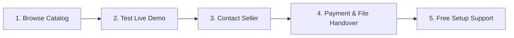

# 🌐 WebCraft Marketplace | Premium Website Showcase & Store

  
  
  
  
  

  

    <strong>A curated collection of modern, responsive, and high-converting website templates built for sale.</strong> 
    View live interactive demos, inspect tech stacks, and purchase source code or custom setups directly!
  

  ---

## 📌 About This Repository

This repository serves as a **live marketplace & portfolio** showcasing ready-made websites, landing pages, and web apps available for purchase. Each listing includes a **live preview link**, full feature breakdown, pricing, and purchase instructions.

Whether you need a sleek SaaS landing page, an e-commerce storefront, or a personal portfolio, you can preview the working output live before buying.

---

## 🔥 Featured Websites & Templates

Below is the active catalog of websites ready for instant acquisition or customization:

| Preview | Name & Category | Tech Stack | Status / Price | Live Demo | Action |
| :---: | :--- | :---: | :---: | :---: | :---: |
| 🚀 | **NovaSaaS - Dark Mode Landing Page** SaaS / Tech | `HTML5` `CSS3` `JS` | `Available` **$49** | [🌐 View Demo](https://example.com/demo/novasaas) | [📩 Inquire / Buy](#-contact--inquiries) |
| 🛒 | **AuraStore - Minimal E-Commerce** E-Commerce | `HTML5` `CSS3` `JS` | `Available` **$79** | [🌐 View Demo](https://example.com/demo/aurastore) | [📩 Inquire / Buy](#-contact--inquiries) |
| 💼 | **ApexAgency - Modern Portfolio** Agency / Freelancer | `HTML5` `CSS3` `JS` | `Available` **$39** | [🌐 View Demo](https://example.com/demo/apexagency) | [📩 Inquire / Buy](#-contact--inquiries) |
| 🍕 | **BistroFlow - Restaurant & Booking** Local Business | `HTML5` `CSS3` `JS` | `Available` **$59** | [🌐 View Demo](https://example.com/demo/bistroflow) | [📩 Inquire / Buy](#-contact--inquiries) |

> 💡 **Tip:** Click on **View Demo** to see the fully working live website output in your browser!

---

## 🛍️ How to Buy & Order

Buying a website template or ordering a custom website is quick and simple:

### Step-by-Step Purchase Guide:
1. **Explore the Showcase**: Browse the table above or open our [Interactive Web Showcase](./index.html).
2. **Preview the Live Output**: Click the demo link to test responsiveness, design, and animations.
3. **Contact Me**: Send a message with the **Website Name** you want to buy (see [Contact Info](#-contact--inquiries)).
4. **Instant Delivery**: Upon payment completion, you receive full source code access (ZIP or GitHub repo access).
5. **Deployment & Customization**: Includes guidance on hosting your site on Netlify, Vercel, or GitHub Pages for free!

---

## 🛠️ What's Included in Every Sale?

When you purchase a website from this collection, you receive:
- ✅ **Full Source Code Ownership** (Clean HTML, CSS, JS, Assets)
- ✅ **100% Responsive Design** (Optimized for Mobile, Tablet, & Desktop)
- ✅ **SEO & Performance Optimized** (Fast load speed, clean metadata)
- ✅ **Documentation & Setup Guide** (Easy setup instructions)
- ✅ **7 Days Free Support** for minor content tweaks & deployment assistance

---

## 💼 Custom Website Development

Need something custom-built from scratch or tailored specifically to your brand?
I offer custom web development services:

- 🎨 **Custom Landing Pages** (High-converting UI/UX)
- 🛍️ **E-Commerce Solutions**
- ⚡ **Performance Optimization** & Speed Boosts
- 📱 **Mobile-First Redesigns**

---

## 📞 Contact & Inquiries

Ready to purchase or have questions? Get in touch directly:

- 📧 **Email**: [your.email@example.com](mailto:your.email@example.com)
- 💬 **Discord / Telegram**: `@yourhandle`
- 🌐 **Portfolio**: [yourportfolio.com](https://example.com)
- 🐙 **GitHub**: [@anandpandey2005](https://github.com/anandpandey2005)

---

## ➕ How to Add a New Website to this Repo

If you want to update this list with your own newly built websites:

1. Open `README.md` and add a new row to the [Featured Websites Table](#-featured-websites--templates).
2. Update `sites.json` with the site details so the interactive webpage (`index.html`) updates automatically.
3. Commit and push your changes!

---

## 📄 Licensing & Terms

- All templates are sold under a **Commercial License** allowing full use for personal or client projects.
- Reselling or redistributing raw source code as a standalone template bundle without authorization is prohibited.

  Built with ❤️ by Anand Pandey • Happy Coding & Sales!

